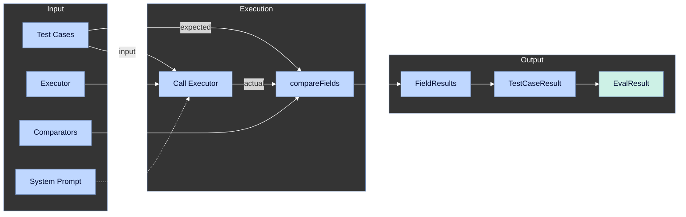
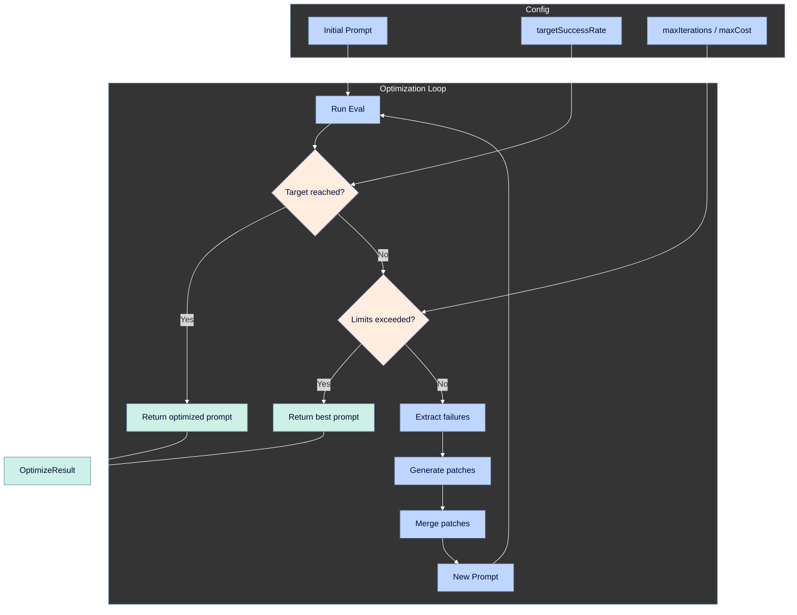

# Didactic

[](https://github.com/DocShield-Labs/didactic/actions/workflows/ci.yml)
[](https://www.npmjs.com/package/@docshield/didactic)
[](https://opensource.org/licenses/MIT)

Eval and optimization framework for LLM workflows.

## Installation

```bash
npm install @docshield/didactic
```

Requires Node.js >= 18.0.0

## Quick Start

```typescript
import { didactic, within, oneOf, exact } from '@docshield/didactic';

const result = await didactic.eval({
  executor: didactic.endpoint('https://api.example.com/extract'),
  comparators: {
    premium: within({ tolerance: 0.05 }),
    policyType: oneOf(['claims-made', 'occurrence']),
    carrier: exact,
  },
  testCases: [
    {
      input: { emailId: 'email-123' },
      expected: { premium: 12500, policyType: 'claims-made', carrier: 'Acme Insurance' },
    },
  ],
});

console.log(`${result.passed}/${result.total} passed (${result.accuracy * 100}% field accuracy)`);
```

---

## Core Concepts

Didactic has three core components:

1. **[Executors](#executors)** — Abstraction for running your LLM workflow (local function, HTTP endpoint, or Temporal workflow)
2. **[Comparators](#comparators)** — Field-level comparison logic that handles real-world data messiness
3. **[Optimization](#didacticoptimizeevalconfig-optimizeconfig)** — Iterative prompt improvement loop to hit target success rates

**How they work together:** Your executor runs each test case's input through your LLM workflow, returning output that matches your test case's expected output. Comparators then evaluate each field of the output against expected values, producing pass/fail results.

In optimization mode, these results feed into an LLM that analyzes failures and generates improved system prompts—repeating until your target success rate or iteration/cost limit is reached.


#### Eval Flow



#### Optimize Flow



---

## API

### `didactic.eval(config)`

The main entry point. Runs your executor over test cases and reports field-level pass/fail results. When `optimize` is provided, it enters optimization mode and iteratively improves the system prompt.

```typescript
const result = await didactic.eval(config);
```

#### EvalConfig

| Property | Type | Kind | Required | Default | Description |
|----------|------|------|----------|---------|-------------|
| `executor` | `Executor<TInput, TOutput>` | Object | **Yes** | — | Function that executes your LLM workflow. Receives input and optional system prompt, returns structured output. |
| `testCases` | `TestCase<TInput, TOutput>[]` | Array | **Yes** | — | Array of `{ input, expected }` pairs. Each test case runs through the executor and compares output to expected. |
| `comparators` | `ComparatorMap` | Object | **One of** | — | Record of field names to comparators. Use when you want different comparison logic per field. |
| `comparator` | `Comparator<TOutput>` | Function | **One of** | — | Single comparator for the entire output object. Use when you need custom whole-object comparison logic. |
| `systemPrompt` | `string` | Primitive | No | — | System prompt passed to the executor. Required if using optimization. |
| `perTestThreshold` | `number` | Primitive | No | `1.0` | Minimum field pass rate for a test case to pass (0.0–1.0). At default 1.0, all fields must pass. Set to 0.8 to pass if 80% of fields match. |
| `unorderedList` | `boolean` | Primitive | No | `false` | Enable Hungarian matching for array comparison. When true, arrays are matched by similarity rather than index position. Used when your expected output is an array of things. |
| `rateLimitBatch` | `number` | Primitive | No | — | Number of test cases to run concurrently. Use with `rateLimitPause` for rate-limited APIs. |
| `rateLimitPause` | `number` | Primitive | No | — | Seconds to wait between batches. Pairs with `rateLimitBatch`. |
| `optimize` | `OptimizeConfig` | Object | No | — | Inline optimization config. When provided, triggers optimization mode instead of single eval. |

---

### `didactic.optimize(evalConfig, optimizeConfig)`

Run optimization as a separate call instead of inline.

```typescript
const result = await didactic.optimize(evalConfig, optimizeConfig);
```

```typescript
const config = {
  ...evalConfig,
  optimize: {
    systemPrompt: 'Extract information from an invoice.',
    targetSuccessRate: 0.9,
    apiKey: 'your-llm-provider-api-key',
    provider: LLMProviders.openai_gpt5,
    maxIterations: 10,
    maxCost: 10,
    storeLogs: true,
    thinking: true,
  },
}
```

#### OptimizeConfig

| Property | Type | Required | Default | Description |
|----------|------|----------|---------|-------------|
| `systemPrompt` | `string` | **Yes** | — | Initial system prompt to optimize. This is the starting point that the optimizer will iteratively improve. |
| `targetSuccessRate` | `number` | **Yes** | — | Target success rate to achieve (0.0–1.0). Optimization stops when this rate is reached. |
| `apiKey` | `string` | **Yes** | — | API key for the LLM provider used by the optimizer (not your workflow's LLM). |
| `provider` | `LLMProviders` | **Yes** | — | LLM provider the optimizer uses to analyze failures and generate improved prompts. |
| `maxIterations` | `number` | No | `5` | Maximum optimization iterations before stopping, even if target not reached. |
| `maxCost` | `number` | No | — | Maximum cost budget in dollars. Optimization stops if cumulative cost exceeds this. |
| `storeLogs` | `boolean \| string` | No | — | Save optimization logs. `true` uses default path (`./didactic-logs/optimize_<timestamp>/summary.md`), or provide custom summary path. |
| `thinking` | `boolean` | No | — | Enable extended thinking mode for deeper analysis (provider must support it). |

---

## Executors

Executors abstract your LLM workflow from the evaluation harness. Whether your workflow runs locally, calls a remote API, or orchestrates Temporal activities, executors provide a consistent interface: take input + optional system prompt, return expected output.

This separation enables:
- **Swap execution strategies** — Switch between local/remote without changing tests
- **Dynamic prompt injection** — System prompts flow through for optimization
- **Cost tracking** — Aggregate execution costs across test runs

didactic provides two built-in executors:
- `endpoint` for calling a remote API
- `fn` for calling a local function

For each of these, you will want to provide a `mapResponse` function to transform the raw response into the output shape you want compared against `expected`.
You will also want to provide a `mapCost` function to extract the execution cost from the response.
You may want to provide a `mapAdditionalContext` function to extract metadata from the response for debugging.

Note: If you do not provide a `mapResponse` function, the executor will assume the response from the executor is the output you want to compare against `expected`.


### `endpoint(url, config?)`

Create an executor that calls an HTTP endpoint. The executor sends input + systemPrompt as the request body and expects structured JSON back.

```typescript
import { endpoint } from '@docshield/didactic';

const executor = endpoint('https://api.example.com/workflow', {
  headers: { Authorization: 'Bearer token' },
  timeout: 60000,
  mapResponse: (response) => response.data.result,
  mapCost: (response) => response.cost,
  mapAdditionalContext: (response) => response.metadata,
});
```

#### EndpointConfig

| Property | Type | Required | Default | Description |
|----------|------|----------|---------|-------------|
| `method` | `'POST' \| 'GET'` | No | `'POST'` | HTTP method for the request. |
| `headers` | `Record<string, string>` | No | `{}` | Headers to include (auth tokens, content-type overrides, etc). |
| `mapResponse` | `(response: any) => TOutput` | No | — | Transform the raw response to your expected output shape. Use when your API wraps results. |
| `mapAdditionalContext` | `(response: any) => unknown` | No | — | Extract metadata (logs, debug info) from response for inspection. |
| `mapCost` | `(response: any) => number` | No | — | Extract execution cost from response (e.g., token counts in headers). |
| `timeout` | `number` | No | `30000` | Request timeout in milliseconds. |

---

### `fn(config)`

Create an executor from a local async function. Use this to write a custom executor for your LLM workflow.

```typescript
import { fn } from '@docshield/didactic';

const executor = fn({
  fn: async (input, systemPrompt) => {
    return await myLLMCall(input, systemPrompt);
  },
  mapResponse: (result) => result.output,
  mapCost: (result) => result.usage.input_tokens * 0.000003 + result.usage.output_tokens * 0.000015,
  mapAdditionalContext: (result) => ({ model: result.model, finishReason: result.stop_reason }),
});
```

#### FnConfig

| Property | Type | Required | Default | Description |
|----------|------|----------|---------|-------------|
| `fn` | `(input: TInput, systemPrompt?: string) => Promise<TRaw>` | **Yes** | — | Async function that executes your workflow. Receives test input and optional system prompt. |
| `mapResponse` | `(result: TRaw) => TOutput` | No | — | Transform raw result from fn into the expected output shape to compare. Without this, raw result is used directly. |
| `mapAdditionalContext` | `(result: TRaw) => unknown` | No | — | Map additional context about the run to pass to the optimizer prompt. |
| `mapCost` | `(result: TRaw) => number` | No | — | Extract cost from the result (if your function tracks it). Used to track the total cost of the runs. |

---

### Response Mapping

Executors support optional mapping functions to extract and transform data from responses:

#### `mapResponse`

Transform the raw response into the expected output shape you want compared against `expected`.

```typescript
// For endpoint: API returns { data: { result: {...} }, metadata: {...} }
const executor = endpoint('https://api.example.com/extract', {
  mapResponse: (response) => response.data.result,
});

// For fn: Workflow returns full response, we only want specific fields
const executor = fn({
  fn: async (input, systemPrompt) => {
    return await startWorkflow({ ... });  // Returns { documentType, cost, confidence, ... }
  },
  mapResponse: (result) => ({ documentType: result.documentType }),
  mapCost: (result) => result.cost,
  mapAdditionalContext: (result) => ({ confidence: result.confidence }),
});
```

Without `mapResponse`:
- **endpoint**: uses the raw JSON response as output
- **fn**: uses the function's return value directly as output

#### `mapAdditionalContext`

Extract additional context from the output to be passed to the optimizer prompt. You can use this to include additional information about the run that could be useful for the optimizer understand the failure and generate a better prompt.

```typescript
// For endpoint: receives the raw API response
const executor = endpoint('https://api.example.com/extract', {
  mapAdditionalContext: (response) => ({
    fileNames: response.fileNames,
    parsedFiles: response.parsedFiles,
  }),
});

// For fn: receives the function's return value
const executor = fn({
  fn: async (input, systemPrompt) => {
    const result = await myLLMCall(input, systemPrompt);
    return result;
  },
  mapAdditionalContext: (result) => ({
    tokensUsed: result.usage?.total_tokens,
    finishReason: result.finish_reason,
  }),
});
```

#### `mapCost`

Extract execution cost from responses for budget tracking. Returns a number representing cost (typically in dollars). Aggregated in `EvalResult.cost` and `OptimizeResult.totalCost`.

```typescript
// For endpoint: extract from response body or calculate from token counts
const executor = endpoint('https://api.example.com/extract', {
  mapCost: (response) => {
    const tokens = response.usage?.total_tokens ?? 0;
    return tokens * 0.00001;  // assuming $0.01 per 1000 tokens
  },
});

// For fn: calculate from the result
const executor = fn({
  fn: async (input, systemPrompt) => {
    const result = await anthropic.messages.create({ ... });
    return result;
  },
  mapCost: (result) => {
    const inputCost = result.usage.input_tokens * (3 / 1_000_000);   // Sonnet input
    const outputCost = result.usage.output_tokens * (15 / 1_000_000); // Sonnet output
    return inputCost + outputCost;
  },
});
```

---

## Comparators

Comparators bridge the gap between messy LLM output and semantic correctness. Rather than requiring exact string matches, comparators handle real-world data variations—currency formatting, date formats, name suffixes, numeric tolerance—while maintaining semantic accuracy.

Each comparator returns a `passed` boolean and a `similarity` score (0.0–1.0). The pass/fail determines test results, while similarity enables Hungarian matching for unordered array comparison.

### `comparators` vs `comparator`

Use **`comparators`** (field-level) when your output is an object or list of objects and you want different comparison logic per field:

```typescript
const result = await didactic.eval({
  executor: myExecutor,
  comparators: {
    premium: within({ tolerance: 0.05 }),  // 5% tolerance for numbers
    carrier: exact,                         // Exact string match
    effectiveDate: date,                    // Flexible date parsing
  },
  testCases: [
    {
      input: { emailId: 'email-123' },
      expected: { premium: 12500, carrier: 'Acme Insurance', effectiveDate: '2024-01-15' },
    },
  ],
});
```

Use **`comparator`** (whole-object) when:
- Your output is a **primitive value** (string, number, boolean)
- You need **custom comparison logic** for the entire output
- You want a **single comparator** applied uniformly

```typescript
// Primitive output
const result = await didactic.eval({
  executor: myNumberExtractor,
  comparator: exact,
  testCases: [
    { input: 'twenty-three', expected: 23 },
    { input: 'one hundred', expected: 100 },
  ],
});

// Custom whole-object comparison
const result = await didactic.eval({
  executor: myExecutor,
  comparator: custom({
    compare: (expected, actual) => {
      return expected.id === actual.id && expected.status === actual.status;
    },
  }),
  testCases: [...],
});
```

### Built-in Comparators

| Comparator | Signature | Description |
|------------|-----------|-------------|
| `exact` | `(expected, actual)` | Deep equality with cycle detection. Default when no comparator specified. |
| `within` | `({ tolerance, mode? })` | Numeric tolerance. `mode: 'percentage'` (default) or `'absolute'`. |
| `oneOf` | `(allowedValues)` | Enum validation. Passes if actual equals expected AND both are in the allowed set. |
| `contains` | `(substring)` | String contains check. Passes if actual includes the substring. |
| `presence` | `(expected, actual)` | Existence check. Passes if expected is absent, or if actual has any value when expected does. |
| `numeric` | `(expected, actual)` | Numeric comparison after stripping currency symbols, commas, accounting notation. |
| `numeric.nullable` | `(expected, actual)` | Same as `numeric`, but treats null/undefined/empty as 0. |
| `date` | `(expected, actual)` | Date comparison after normalizing formats (ISO, US MM/DD, EU DD/MM, written). |
| `name` | `(expected, actual)` | Name comparison with case normalization, suffix removal (Inc, LLC), fuzzy matching. |
| `custom` | `({ compare })` | User-defined logic. `compare(expected, actual, context?) => boolean`. Context provides access to parent objects for cross-field logic. |

### Examples

```typescript
import { within, oneOf, exact, contains, presence, numeric, date, name, custom } from '@docshield/didactic';

const comparators = {
  premium: within({ tolerance: 0.05 }),                      // 5% tolerance
  deductible: within({ tolerance: 100, mode: 'absolute' }),  // $100 tolerance
  policyType: oneOf(['claims-made', 'occurrence', 'entity']),
  carrier: exact,
  notes: contains('approved'),
  entityName: name,
  effectiveDate: date,
  amount: numeric,
  optionalField: presence,
  customField: custom({
    compare: (expected, actual, context) => {
      // Access sibling fields via context.actualParent
      return actual.toLowerCase() === expected.toLowerCase();
    },
  }),
};
```

---

## LLMProviders

Supported LLM providers for the optimizer:

```typescript
import { LLMProviders } from '@docshield/didactic';
```

| Value | Description |
|-------|-------------|
| `LLMProviders.anthropic_claude_opus` | Claude Opus 4.5 — Most capable, highest cost |
| `LLMProviders.anthropic_claude_sonnet` | Claude Sonnet 4.5 — Balanced performance/cost |
| `LLMProviders.anthropic_claude_haiku` | Claude Haiku 4.5 — Fastest, lowest cost |
| `LLMProviders.openai_gpt5` | GPT-5.2 — OpenAI flagship |
| `LLMProviders.openai_gpt5_mini` | GPT-5 Mini — OpenAI lightweight |

---

## Output Types

### EvalResult

Returned by `didactic.eval()` when no optimization is configured.

| Property | Type | Description |
|----------|------|-------------|
| `systemPrompt` | `string \| undefined` | System prompt that was used for this eval run. |
| `testCases` | `TestCaseResult[]` | Detailed results for each test case. Inspect for field-level failure details. |
| `passed` | `number` | Count of test cases that passed (met `perTestThreshold`). |
| `total` | `number` | Total number of test cases run. |
| `successRate` | `number` | Pass rate (0.0–1.0). `passed / total`. |
| `correctFields` | `number` | Total correct fields across all test cases. |
| `totalFields` | `number` | Total fields evaluated across all test cases. |
| `accuracy` | `number` | Field-level accuracy (0.0–1.0). `correctFields / totalFields`. |
| `cost` | `number` | Total execution cost aggregated from executor results. |

### TestCaseResult

Per-test-case detail, accessible via `EvalResult.testCases`.

| Property | Type | Description |
|----------|------|-------------|
| `input` | `TInput` | The input that was passed to the executor. |
| `expected` | `TOutput` | The expected output from the test case. |
| `actual` | `TOutput \| undefined` | Actual output returned by executor. Undefined if execution failed. |
| `passed` | `boolean` | Whether this test case passed (met `perTestThreshold`). |
| `fields` | `Record<string, FieldResult>` | Per-field comparison results. Key is field path (e.g., `"address.city"`). |
| `passedFields` | `number` | Count of fields that passed comparison. |
| `totalFields` | `number` | Total fields compared. |
| `passRate` | `number` | Field pass rate for this test case (0.0–1.0). |
| `cost` | `number \| undefined` | Execution cost for this test case, if reported by executor. |
| `additionalContext` | `unknown \| undefined` | Extra context extracted by executor (logs, debug info). |
| `error` | `string \| undefined` | Error message if executor threw an exception. |

### OptimizeResult

Returned by `didactic.optimize()` or `didactic.eval()` with optimization configured.

| Property | Type | Description |
|----------|------|-------------|
| `success` | `boolean` | Whether the target success rate was achieved. |
| `finalPrompt` | `string` | The final optimized system prompt. Use this in production. |
| `iterations` | `IterationResult[]` | Results from each optimization iteration. Inspect to see how the prompt evolved. |
| `totalCost` | `number` | Total cost across all iterations (optimizer + executor costs). |
| `logFolder` | `string \| undefined` | Folder path where optimization logs were written (only when `storeLogs` is enabled). |

### IterationResult

Per-iteration detail, accessible via `OptimizeResult.iterations`.

| Property | Type | Description |
|----------|------|-------------|
| `iteration` | `number` | Iteration number (1-indexed). |
| `systemPrompt` | `string` | System prompt used for this iteration. |
| `passed` | `number` | Test cases passed in this iteration. |
| `total` | `number` | Total test cases in this iteration. |
| `testCases` | `TestCaseResult[]` | Detailed test case results for this iteration. |
| `cost` | `number` | Cost for this iteration. |

---

## Optimization Logs

When `storeLogs` is enabled in `OptimizeConfig`, four files are written to the log folder after optimization completes:

**Default path:** `./didactic-logs/optimize_<timestamp>/`

| File | Description |
|------|-------------|
| `summary.md` | Human-readable report with configuration, metrics, and iteration progress |
| `prompts.md` | All system prompts used in each iteration |
| `rawData.json` | Complete iteration data for programmatic analysis |
| `bestRun.json` | Detailed results from the best-performing iteration |

### rawData.json

Contains the complete optimization run data for programmatic analysis:

```typescript
interface OptimizationReport {
  metadata: {
    timestamp: string;              // ISO timestamp
    model: string;                  // LLM model used
    provider: string;               // Provider (anthropic, openai, etc)
    thinking: boolean;              // Extended thinking enabled
    targetSuccessRate: number;      // Target (0.0-1.0)
    maxIterations: number | null;   // Max iterations or null
    maxCost: number | null;         // Max cost budget or null
    testCaseCount: number;          // Number of test cases
    perTestThreshold: number;       // Per-test threshold (default 1.0)
    rateLimitBatch?: number;        // Batch size for rate limiting
    rateLimitPause?: number;        // Pause seconds between batches
  };
  summary: {
    totalIterations: number;
    totalDurationMs: number;
    totalCost: number;
    totalInputTokens: number;
    totalOutputTokens: number;
    startRate: number;              // Success rate at start
    endRate: number;                // Success rate at end
    targetMet: boolean;
  };
  best: {
    iteration: number;              // Which iteration was best
    successRate: number;            // Success rate (0.0-1.0)
    passed: number;                 // Number of passing tests
    total: number;                  // Total tests
    fieldAccuracy: number;          // Field-level accuracy
  };
  iterations: Array<{
    iteration: number;
    successRate: number;
    passed: number;
    total: number;
    correctFields: number;
    totalFields: number;
    fieldAccuracy: number;
    cost: number;                   // Cost for this iteration
    cumulativeCost: number;         // Total cost so far
    durationMs: number;
    inputTokens: number;
    outputTokens: number;
    failures: Array<{
      testIndex: number;
      input: unknown;
      expected: unknown;
      actual: unknown;
      fields: Record<string, { expected: unknown; actual: unknown; passed: boolean }>;
    }>;
  }>;
}
```

### bestRun.json

Contains detailed results from the best-performing iteration, with test results categorized into failures, partial failures, and successes:

```typescript
interface BestRunReport {
  metadata: {
    iteration: number;              // Which iteration was best
    model: string;
    provider: string;
    thinking: boolean;
    targetSuccessRate: number;
    perTestThreshold: number;
    rateLimitBatch?: number;
    rateLimitPause?: number;
  };
  results: {
    successRate: number;            // Overall success rate
    passed: number;                 // Passed tests
    total: number;                  // Total tests
    fieldAccuracy: number;          // Field-level accuracy
    correctFields: number;
    totalFields: number;
  };
  cost: {
    iteration: number;              // Cost for this iteration
    cumulative: number;             // Total cumulative cost
  };
  timing: {
    durationMs: number;
    inputTokens: number;
    outputTokens: number;
  };
  failures: Array<{                 // Tests that didnt meet the configured perTestThreshold
    testIndex: number;
    input: unknown;
    expected: unknown;
    actual: unknown;
    failedFields: Record<string, { expected: unknown; actual: unknown }>;
  }>;
  partialFailures: Array<{          // Tests that passed but have some failing fields
    testIndex: number;
    passRate: number;               // Percentage of fields passing
    input: unknown;
    expected: unknown;
    actual: unknown;
    failedFields: Record<string, { expected: unknown; actual: unknown }>;
  }>;
  successes: Array<{                // Tests with 100% field accuracy
    testIndex: number;
    input: unknown;
    expected: unknown;
    actual: unknown;
  }>;
}
```

---

## Exports

```typescript
// Namespace
import { didactic } from '@docshield/didactic';
import didactic from '@docshield/didactic';  // default export

// Comparators
import { exact, within, oneOf, contains, presence, numeric, date, name, custom } from '@docshield/didactic';

// Executors
import { endpoint, fn } from '@docshield/didactic';

// Functions
import { evaluate, optimize } from '@docshield/didactic';

// Types
import type {
  Comparator,
  ComparatorMap,
  ComparatorResult,
  ComparatorContext,
  Executor,
  ExecutorResult,
  TestCase,
  EvalConfig,
  EvalResult,
  TestCaseResult,
  FieldResult,
  OptimizeConfig,
  OptimizeResult,
  IterationResult,
  EndpointConfig,
  FnConfig,
} from '@docshield/didactic';

// Enum
import { LLMProviders } from '@docshield/didactic';
```

## Local Development

```bash
# Build and publish locally
npm run build && yalc publish

# In your project
yalc add @docshield/didactic
```
