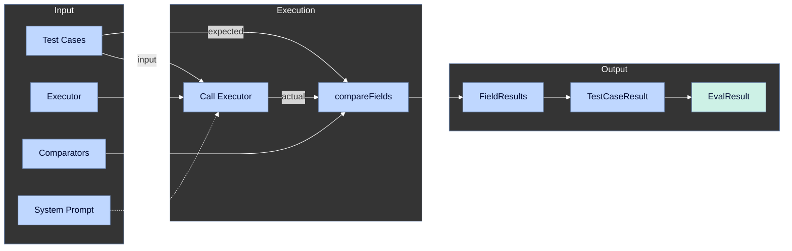
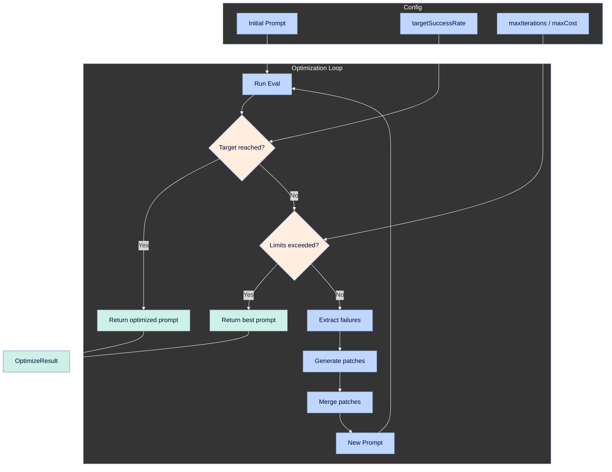

# Didactic Flow Charts

## Eval Flow

```mermaid
flowchart LR
    subgraph Input ["Input"]
        TC[Test Cases]
        EX[Executor]
        CMP[Comparators]
        SP[System Prompt]
    end

    subgraph Execution ["Execution"]
        CEX[Call Executor]
        CF[compareFields]
    end

    subgraph Output ["Output"]
        FR[FieldResults]
        TCR[TestCaseResult]
        ER[EvalResult]
    end

    TC -->|input| CEX
    EX --> CEX
    SP -.-> CEX
    CEX -->|actual| CF
    TC -->|expected| CF
    CMP --> CF
    CF --> FR
    FR --> TCR
    TCR --> ER

    linkStyle default stroke:#FFFFFF
    style Input fill:#343434,stroke:#6D88B4,color:#FFFFFF
    style Execution fill:#343434,stroke:#6D88B4,color:#FFFFFF
    style Output fill:#343434,stroke:#6D88B4,color:#FFFFFF
    style TC fill:#BFD7FF,stroke:#6D88B4,color:#000B33
    style EX fill:#BFD7FF,stroke:#6D88B4,color:#000B33
    style CMP fill:#BFD7FF,stroke:#6D88B4,color:#000B33
    style SP fill:#BFD7FF,stroke:#6D88B4,color:#000B33
    style CEX fill:#BFD7FF,stroke:#6D88B4,color:#000B33
    style CF fill:#BFD7FF,stroke:#6D88B4,color:#000B33
    style FR fill:#BFD7FF,stroke:#6D88B4,color:#000B33
    style TCR fill:#BFD7FF,stroke:#6D88B4,color:#000B33
    style ER fill:#CDF1E6,stroke:#6D88B4,color:#000B33
```

## Optimize Flow

```mermaid
flowchart TB
    subgraph Config ["Config"]
        IP[Initial Prompt]
        TARGET[targetSuccessRate]
        LIMITS[maxIterations / maxCost]
    end

    IP --> EVAL

    subgraph Loop ["Optimization Loop"]
        EVAL[Run Eval] --> CHECK{Target reached?}
        CHECK -->|Yes| SUCCESS[Return optimized prompt]
        CHECK -->|No| LIMIT{Limits exceeded?}
        LIMIT -->|Yes| BEST[Return best prompt]
        LIMIT -->|No| FAIL[Extract failures]
        FAIL --> PATCH[Generate patches]
        PATCH --> MERGE[Merge patches]
        MERGE --> UPDATE[New Prompt]
        UPDATE --> EVAL
    end

    TARGET --> CHECK
    LIMITS --> LIMIT

    SUCCESS --> OUT[OptimizeResult]
    BEST --> OUT

    linkStyle default stroke:#FFFFFF
    style Config fill:#343434,stroke:#6D88B4,color:#FFFFFF
    style Loop fill:#343434,stroke:#6D88B4,color:#FFFFFF
    style IP fill:#BFD7FF,stroke:#6D88B4,color:#000B33
    style TARGET fill:#BFD7FF,stroke:#6D88B4,color:#000B33
    style LIMITS fill:#BFD7FF,stroke:#6D88B4,color:#000B33
    style EVAL fill:#BFD7FF,stroke:#6D88B4,color:#000B33
    style FAIL fill:#BFD7FF,stroke:#6D88B4,color:#000B33
    style PATCH fill:#BFD7FF,stroke:#6D88B4,color:#000B33
    style MERGE fill:#BFD7FF,stroke:#6D88B4,color:#000B33
    style UPDATE fill:#BFD7FF,stroke:#6D88B4,color:#000B33
    style CHECK fill:#FFEDE0,stroke:#6D88B4,color:#000B33
    style LIMIT fill:#FFEDE0,stroke:#6D88B4,color:#000B33
    style SUCCESS fill:#CDF1E6,stroke:#6D88B4,color:#000B33
    style BEST fill:#CDF1E6,stroke:#6D88B4,color:#000B33
    style OUT fill:#CDF1E6,stroke:#6D88B4,color:#000B33
```
